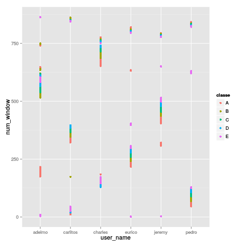
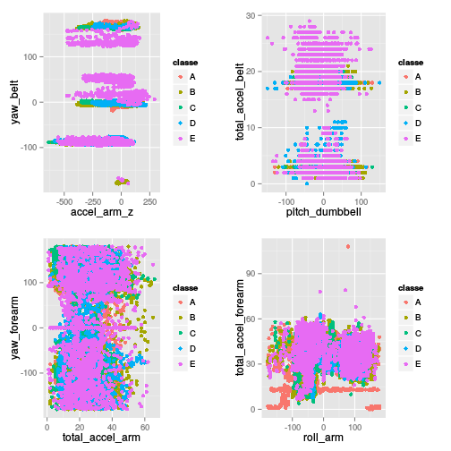

# Coursera Practical Machine Learning - The Course Project


```r
set.seed(174)
library(ggplot2)
library(gridExtra)
```

```
## Loading required package: grid
```

```r
library(doMC)
```

```
## Loading required package: foreach
## Loading required package: iterators
## Loading required package: parallel
```

```r
registerDoMC(cores = 4)
p <- 0.75
k <- 10
```

# Data processing

Raw daset has been loaded into `data.frame` and filtered in odrder to remove summary rows. 


```r
data <- read.csv('~/Workspace/coursera/practical_machine_learning/pml-training.csv', as.is=TRUE, na.strings=c('', NA))
data <- data[data$new_window == "no", ]
```

Resulting dataset contains 19216 rows and 160 columns.

After loading `user_name` and `classe` column have been converted into `factor` variables. 


```r
data$classe <- factor(data$classe)
data$user_name <- factor(data$user_name)
```

Dataset has been splited into train and test dataset using `caret::createDataPartition` with `p` equal to 0.75.


```r
inTrain <- caret::createDataPartition(data$classe, p=p, list=FALSE)
training <- data[inTrain, ]
testing <- data[-inTrain, ]
```


Dataset contains large number of summary columns. Since summary rows have been removed those columns contain only `NA` values and are no longer relevant and can be removed.


```r
summary.columns <- round(apply(training, 2, function(x) {return(sum(is.na(x)/dim(training)[1]))}), 2) == 1.0
colnames(training)[summary.columns]
```

```
##   [1] "kurtosis_roll_belt"       "kurtosis_picth_belt"     
##   [3] "kurtosis_yaw_belt"        "skewness_roll_belt"      
##   [5] "skewness_roll_belt.1"     "skewness_yaw_belt"       
##   [7] "max_roll_belt"            "max_picth_belt"          
##   [9] "max_yaw_belt"             "min_roll_belt"           
##  [11] "min_pitch_belt"           "min_yaw_belt"            
##  [13] "amplitude_roll_belt"      "amplitude_pitch_belt"    
##  [15] "amplitude_yaw_belt"       "var_total_accel_belt"    
##  [17] "avg_roll_belt"            "stddev_roll_belt"        
##  [19] "var_roll_belt"            "avg_pitch_belt"          
##  [21] "stddev_pitch_belt"        "var_pitch_belt"          
##  [23] "avg_yaw_belt"             "stddev_yaw_belt"         
##  [25] "var_yaw_belt"             "var_accel_arm"           
##  [27] "avg_roll_arm"             "stddev_roll_arm"         
##  [29] "var_roll_arm"             "avg_pitch_arm"           
##  [31] "stddev_pitch_arm"         "var_pitch_arm"           
##  [33] "avg_yaw_arm"              "stddev_yaw_arm"          
##  [35] "var_yaw_arm"              "kurtosis_roll_arm"       
##  [37] "kurtosis_picth_arm"       "kurtosis_yaw_arm"        
##  [39] "skewness_roll_arm"        "skewness_pitch_arm"      
##  [41] "skewness_yaw_arm"         "max_roll_arm"            
##  [43] "max_picth_arm"            "max_yaw_arm"             
##  [45] "min_roll_arm"             "min_pitch_arm"           
##  [47] "min_yaw_arm"              "amplitude_roll_arm"      
##  [49] "amplitude_pitch_arm"      "amplitude_yaw_arm"       
##  [51] "kurtosis_roll_dumbbell"   "kurtosis_picth_dumbbell" 
##  [53] "kurtosis_yaw_dumbbell"    "skewness_roll_dumbbell"  
##  [55] "skewness_pitch_dumbbell"  "skewness_yaw_dumbbell"   
##  [57] "max_roll_dumbbell"        "max_picth_dumbbell"      
##  [59] "max_yaw_dumbbell"         "min_roll_dumbbell"       
##  [61] "min_pitch_dumbbell"       "min_yaw_dumbbell"        
##  [63] "amplitude_roll_dumbbell"  "amplitude_pitch_dumbbell"
##  [65] "amplitude_yaw_dumbbell"   "var_accel_dumbbell"      
##  [67] "avg_roll_dumbbell"        "stddev_roll_dumbbell"    
##  [69] "var_roll_dumbbell"        "avg_pitch_dumbbell"      
##  [71] "stddev_pitch_dumbbell"    "var_pitch_dumbbell"      
##  [73] "avg_yaw_dumbbell"         "stddev_yaw_dumbbell"     
##  [75] "var_yaw_dumbbell"         "kurtosis_roll_forearm"   
##  [77] "kurtosis_picth_forearm"   "kurtosis_yaw_forearm"    
##  [79] "skewness_roll_forearm"    "skewness_pitch_forearm"  
##  [81] "skewness_yaw_forearm"     "max_roll_forearm"        
##  [83] "max_picth_forearm"        "max_yaw_forearm"         
##  [85] "min_roll_forearm"         "min_pitch_forearm"       
##  [87] "min_yaw_forearm"          "amplitude_roll_forearm"  
##  [89] "amplitude_pitch_forearm"  "amplitude_yaw_forearm"   
##  [91] "var_accel_forearm"        "avg_roll_forearm"        
##  [93] "stddev_roll_forearm"      "var_roll_forearm"        
##  [95] "avg_pitch_forearm"        "stddev_pitch_forearm"    
##  [97] "var_pitch_forearm"        "avg_yaw_forearm"         
##  [99] "stddev_yaw_forearm"       "var_yaw_forearm"
```

```r
training <- training[, !summary.columns]
```

Several variables (like `num_window` or `cvtd_timestamp`) show clear functional relation with `classe` for each user. 


```r
ggplot(training, aes(x=user_name, y=num_window, colour=classe)) + geom_point()
```

 

These variables are clearly related to the data collection process and I decided not to use any of these (as well as the user id) for my model.


```r
numeric.features <- 8:60
dim(training)
```

```
## [1] 14414    60
```

```r
training <- training[, numeric.features]
```

From the resulting dataset I removed highly correlated variables using `caret::findCorrelation` function.


```r
highly.corelated <- caret::findCorrelation(cor(training[, 1:52]), cutoff=0.8)
training <- training[, -highly.corelated]
```

As a result of described steps I reduced number of variables to 159.
Exploratory data analysis on the remaining data showed multiple class-based clusters. Based on clusters distribution I decided to use random forests.


```r
grid.arrange(
    ggplot(training, aes(x=accel_arm_z, y=yaw_belt, colour=classe)) + geom_point(),
    ggplot(training, aes(x=pitch_dumbbell, y=total_accel_belt, colour=classe)) + geom_point(),
    ggplot(training, aes(x=total_accel_arm, y=yaw_forearm, colour=classe)) + geom_point(),
    ggplot(training, aes(x=roll_arm, y=total_accel_forearm, colour=classe)) + geom_point(),
    ncol=2
)
```

 

# Cross-validation

To estimate out of sample error 10-fold cross validation has been used.


```r
folds <- caret::createFolds(training$classe, k=k, list=TRUE, returnTrain=FALSE)
modelFits <- lapply(folds, function(fold) {
    return(
        list(
            modelFitRF = NA,
            predictionRF = NA,
            result = NA
        )
    )
})

for (i in 1:k) {
    
    fold <- folds[[i]]
    modelFitRF <- caret::train(
        classe ~ ., method='rf', data=training[-fold, ]
    )
    predictionRF <- predict(modelFitRF, training[fold, ])
    result <- caret::confusionMatrix(
        predictionRF, training[fold, ]$classe
    )
    modelFits[[i]] <- list(
        modelFitRF = modelFitRF,
        predictionRF = predictionRF,
        result = result
    )
}
```

```
## Loading required package: randomForest
## randomForest 4.6-7
## Type rfNews() to see new features/changes/bug fixes.
## Loading required package: lattice
```

```r
mean.accuracy <- mean(sapply(modelFits, function(x) { return(x$result$overall[[1]]) }))
sd.accuracy <- sd(sapply(modelFits, function(x) { return(x$result$overall[[1]]) }))
sqrt.n <- sqrt(k)
se.accuracy <- sd.accuracy / sqrt.n
ci <- list(lower=round(mean.accuracy - se.accuracy * 1.96, 4), upper=round(mean.accuracy + se.accuracy * 1.96, 4))
```

Based on the results of the cross-validation step we can calculate 95% confidence interval for accuracy as (0.9897, 0.992).


# Final results

Best performing model has been applied to the testing and after that used for the final submission.


```r
modelFitRF <- modelFits[[which.max(sapply(modelFits, function(x) { return(x$result$overall[[1]]) }))]]$modelFitRF
predictionRF <- predict(modelFitRF, testing)
caret::confusionMatrix(predictionRF, testing$classe)
```

```
## Confusion Matrix and Statistics
## 
##           Reference
## Prediction    A    B    C    D    E
##          A 1366    3    0    1    0
##          B    1  926    8    1    0
##          C    0    0  828    7    2
##          D    0    0    2  776    5
##          E    0    0    0    1  875
## 
## Overall Statistics
##                                         
##                Accuracy : 0.994         
##                  95% CI : (0.991, 0.996)
##     No Information Rate : 0.285         
##     P-Value [Acc > NIR] : <2e-16        
##                                         
##                   Kappa : 0.992         
##  Mcnemar's Test P-Value : NA            
## 
## Statistics by Class:
## 
##                      Class: A Class: B Class: C Class: D Class: E
## Sensitivity             0.999    0.997    0.988    0.987    0.992
## Specificity             0.999    0.997    0.998    0.998    1.000
## Pos Pred Value          0.997    0.989    0.989    0.991    0.999
## Neg Pred Value          1.000    0.999    0.997    0.998    0.998
## Prevalence              0.285    0.193    0.175    0.164    0.184
## Detection Rate          0.284    0.193    0.172    0.162    0.182
## Detection Prevalence    0.285    0.195    0.174    0.163    0.182
## Balanced Accuracy       0.999    0.997    0.993    0.993    0.996
```


